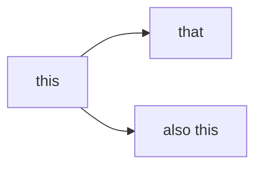

# Headline

> An awesome project.

Remember you manually link (in the _sidebar.md) to new markdowns or dirs with README.md in them.

## Splash

Here

:mi-two-tone check_circle green:

### Nope

Look $f(x) = x^2$ but

$$
\begin{aligned}
f(x) &= g(x) + h(x) + 1 \\
g(x) &= \sin(x) + \text{d}W
\end{aligned}
$$

And see

```python
def f(x):
    return x ** 2
```

```bash
echo "look here"
```

What about



#### Nope nope

this

#### yes

### what

## More

### This

is

#### A

#### B

### Still

here
